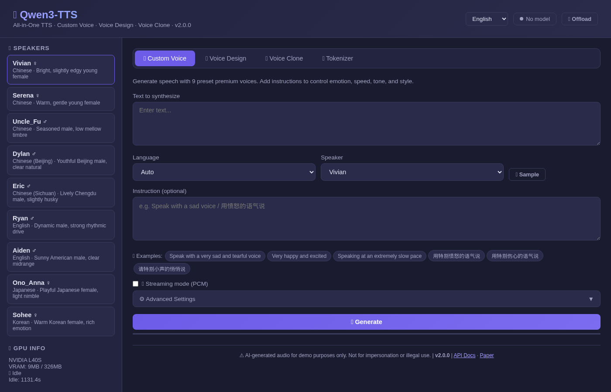
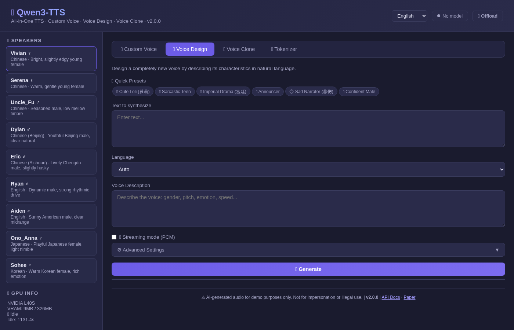
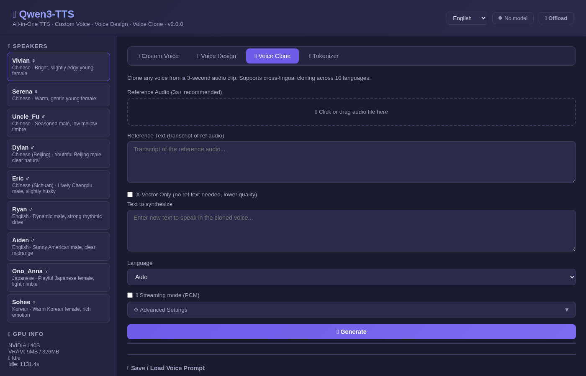

# 🗣️ Qwen3-TTS Docker — All-in-One

<p align="center">
  
</p>

> Production-ready Docker deployment for [Qwen3-TTS](https://github.com/QwenLM/Qwen3-TTS) with a modern Web UI and full REST API. All models baked into a single Docker image — no downloads at runtime.

## 📸 Screenshots

| Custom Voice | Voice Design | Voice Clone |
|:---:|:---:|:---:|
|  |  |  |

## ✨ Features

- **All-in-One Docker Image** — 4 models (~14GB) embedded, zero runtime downloads
- **Modern Web UI** — Dark theme, responsive, pure HTML/JS (no Gradio)
- **Full REST API** — FastAPI with Swagger docs at `/docs`
- **3 TTS Modes** — Custom Voice (9 speakers), Voice Design, Voice Clone
- **10 Languages** — Chinese, English, Japanese, Korean, German, French, Russian, Portuguese, Spanish, Italian
- **Voice Prompt Save/Load** — Save cloned voice as `.pt` file, reuse across sessions
- **Tokenizer API** — Encode/decode audio to speech tokens
- **Performance Metrics** — Model load time, generation time, RTF displayed in UI
- **Multi-language UI** — English / 简体中文 / 繁體中文 / 日本語
- **GPU Management** — Auto-offload after idle timeout, manual offload button
- **FlashAttention 2** — Pre-compiled wheel, no 40-minute build

## 🚀 Quick Start

### Option 1: Docker Hub (Recommended)

```bash
# Pull the all-in-one image (~30GB with models)
docker pull neosun/qwen3-tts:2.0.0

# Run with GPU
docker run -d --name qwen3-tts \
  --gpus '"device=0"' \
  -p 8766:8766 \
  neosun/qwen3-tts:2.0.0
```

### Option 2: Docker Compose

```bash
git clone https://github.com/neosun100/Qwen3-TTS.git
cd Qwen3-TTS

# Edit .env to set your GPU
echo "NVIDIA_VISIBLE_DEVICES=0" > .env

docker compose up -d
```

### Option 3: One-Click Start

```bash
git clone https://github.com/neosun100/Qwen3-TTS.git
cd Qwen3-TTS
bash start.sh
```

Then open: **http://localhost:8766**

| Endpoint | Description |
|---|---|
| `http://localhost:8766` | Web UI |
| `http://localhost:8766/docs` | Swagger API Docs |
| `http://localhost:8766/health` | Health Check |

## 📡 API Reference

### Custom Voice TTS

```bash
curl -X POST http://localhost:8766/api/tts/custom-voice \
  -H "Content-Type: application/json" \
  -d '{
    "text": "Hello, this is a test.",
    "language": "English",
    "speaker": "Ryan",
    "instruct": "Speak with excitement"
  }' -o output.wav
```

### Voice Design TTS

```bash
curl -X POST http://localhost:8766/api/tts/voice-design \
  -H "Content-Type: application/json" \
  -d '{
    "text": "Hello world!",
    "language": "English",
    "instruct": "Young female voice, cheerful and bright"
  }' -o output.wav
```

### Voice Clone TTS

```bash
curl -X POST http://localhost:8766/api/tts/voice-clone \
  -F "text=Hello from a cloned voice" \
  -F "language=English" \
  -F "ref_text=This is the reference transcript" \
  -F "ref_audio=@reference.wav" \
  -o output.wav
```

### All Endpoints

| Method | Endpoint | Description |
|---|---|---|
| GET | `/health` | Health check |
| GET | `/api/speakers` | List speakers with details |
| GET | `/api/languages` | List supported languages |
| GET | `/api/models` | List available models |
| GET | `/api/gpu-status` | GPU memory and model status |
| GET | `/api/sample-texts` | Sample texts per language |
| POST | `/api/gpu-offload` | Manually offload GPU memory |
| POST | `/api/tts/custom-voice` | Custom voice TTS (JSON) |
| POST | `/api/tts/voice-design` | Voice design TTS (JSON) |
| POST | `/api/tts/voice-clone` | Voice clone TTS (FormData) |
| POST | `/api/tts/voice-clone-from-prompt` | TTS from saved voice prompt |
| POST | `/api/voice-prompt/save` | Save voice clone prompt (.pt) |
| POST | `/api/tts/custom-voice/stream` | PCM streaming custom voice |
| POST | `/api/tts/voice-design/stream` | PCM streaming voice design |
| POST | `/api/tts/voice-clone/stream` | PCM streaming voice clone |
| POST | `/api/tokenizer/encode` | Encode audio to tokens |
| POST | `/api/tokenizer/decode` | Decode tokens to audio |

### Response Headers

TTS endpoints return timing headers for performance monitoring:

| Header | Description |
|---|---|
| `X-Time-Load` | Model loading time (seconds) |
| `X-Time-Gen` | Audio generation time (seconds) |
| `X-Time-Total` | Total processing time (seconds) |
| `X-Audio-Duration` | Generated audio duration (seconds) |

## 🎤 Speakers

| Speaker | Gender | Native Language | Description |
|---|---|---|---|
| Vivian | Female | Chinese | Bright, slightly edgy young female |
| Serena | Female | Chinese | Warm, gentle young female |
| Uncle_Fu | Male | Chinese | Seasoned male, low mellow timbre |
| Dylan | Male | Chinese (Beijing) | Youthful Beijing male, clear natural |
| Eric | Male | Chinese (Sichuan) | Lively Chengdu male, slightly husky |
| Ryan | Male | English | Dynamic male, strong rhythmic drive |
| Aiden | Male | English | Sunny American male, clear midrange |
| Ono_Anna | Female | Japanese | Playful Japanese female, light nimble |
| Sohee | Female | Korean | Warm Korean female, rich emotion |

## ⚡ About Streaming

**Important**: Qwen3-TTS does **not** support true incremental audio streaming at the model level. The official Qwen team confirmed this in [Issue #10](https://github.com/QwenLM/Qwen3-TTS/issues/10):

> *"Streaming inference is supported at the model architecture level. Currently, our qwen-tts package primarily focuses on enabling quick demos... For streaming capabilities, ongoing development will be mainly driven by the vLLM-Omni community."*

The `/stream` endpoints in this project generate the full audio first, then deliver it as chunked PCM data. This enables progressive playback via Web Audio API but does **not** reduce time-to-first-byte (TTFB).

For true streaming, monitor:
- [vLLM-Omni](https://github.com/vllm-project/vllm-omni) — Official path for streaming, pending [RFC #938](https://github.com/vllm-project/vllm/issues/938)
- [dffdeeq/Qwen3-TTS-streaming](https://github.com/dffdeeq/Qwen3-TTS-streaming) — Community experimental streaming fork

## 🔧 Configuration

### Environment Variables

| Variable | Default | Description |
|---|---|---|
| `PORT` | `8766` | Server port |
| `NVIDIA_VISIBLE_DEVICES` | `0` | GPU device ID |
| `CUDA_DEVICE` | `cuda:0` | PyTorch device (always `cuda:0` inside container) |
| `GPU_IDLE_TIMEOUT` | `600` | Auto-offload after N seconds idle |
| `QWEN_TTS_MODEL_DIR` | `/app/models` | Model directory path |
| `HF_HUB_OFFLINE` | `1` | Disable HuggingFace downloads |

### GPU Requirements

- Minimum: 6GB VRAM (one model loaded at a time)
- Recommended: 8GB+ VRAM
- Models auto-switch: loading a different model type offloads the previous one

## 🏗️ Build from Source

If you want to build the Docker image yourself:

```bash
git clone https://github.com/neosun100/Qwen3-TTS.git
cd Qwen3-TTS

# Download models first (~14GB total)
pip install -U "huggingface_hub[cli]"
mkdir -p models
huggingface-cli download Qwen/Qwen3-TTS-Tokenizer-12Hz --local-dir ./models/Qwen3-TTS-Tokenizer-12Hz
huggingface-cli download Qwen/Qwen3-TTS-12Hz-1.7B-CustomVoice --local-dir ./models/Qwen3-TTS-12Hz-1.7B-CustomVoice
huggingface-cli download Qwen/Qwen3-TTS-12Hz-1.7B-VoiceDesign --local-dir ./models/Qwen3-TTS-12Hz-1.7B-VoiceDesign
huggingface-cli download Qwen/Qwen3-TTS-12Hz-1.7B-Base --local-dir ./models/Qwen3-TTS-12Hz-1.7B-Base

# Build (uses pre-compiled flash-attn wheel — fast!)
docker build -t neosun/qwen3-tts:2.0.0 .
```

### Why Pre-compiled flash-attn?

Building `flash-attn` from source requires CUDA development headers and takes **40+ minutes** even with `ninja`. This Dockerfile downloads a pre-compiled wheel matching Python 3.12 + CUDA 12 + PyTorch 2.9, reducing install time to **seconds**.

The wheel is from the [official flash-attention releases](https://github.com/Dao-AILab/flash-attention/releases).

## 📦 Embedded Models

| Model | Size | Description |
|---|---|---|
| Qwen3-TTS-12Hz-1.7B-CustomVoice | 4.3GB | 9 preset speakers with instruction control |
| Qwen3-TTS-12Hz-1.7B-VoiceDesign | 4.3GB | Design new voices from text descriptions |
| Qwen3-TTS-12Hz-1.7B-Base | 4.3GB | Voice cloning from 3-second audio |
| Qwen3-TTS-Tokenizer-12Hz | 651MB | Audio tokenizer (encode/decode) |

## 📄 License

This project is licensed under the Apache 2.0 License. The Qwen3-TTS models are subject to the [Qwen License](https://github.com/QwenLM/Qwen3-TTS/blob/main/LICENSE).

## 🙏 Credits

- [Qwen3-TTS](https://github.com/QwenLM/Qwen3-TTS) by Alibaba Qwen Team
- [FlashAttention](https://github.com/Dao-AILab/flash-attention) by Tri Dao
